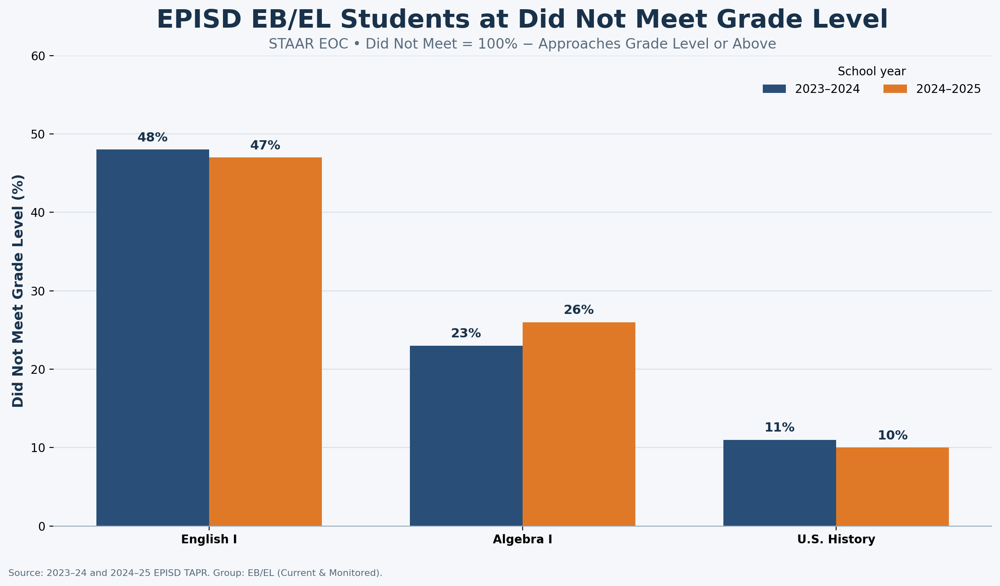
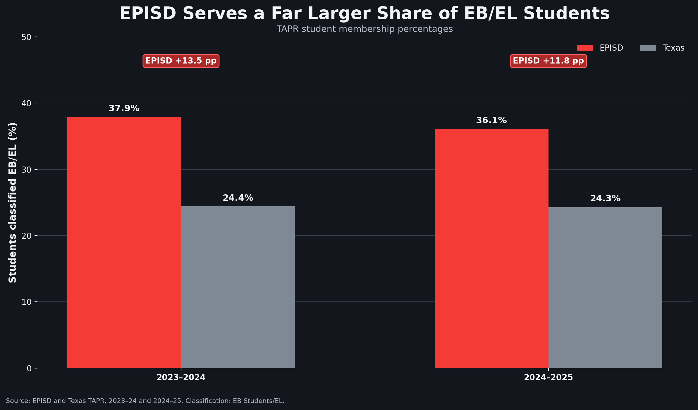
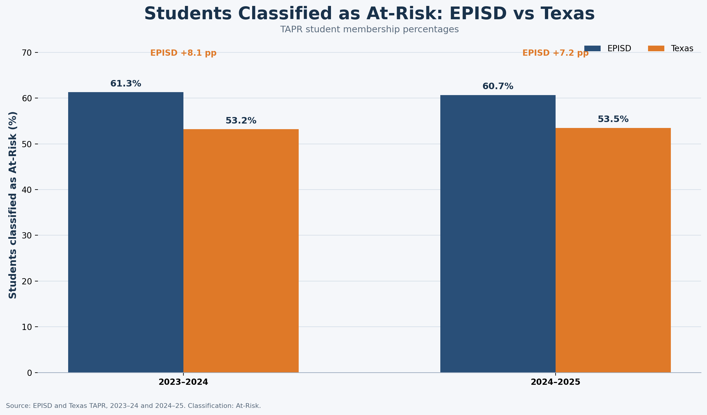
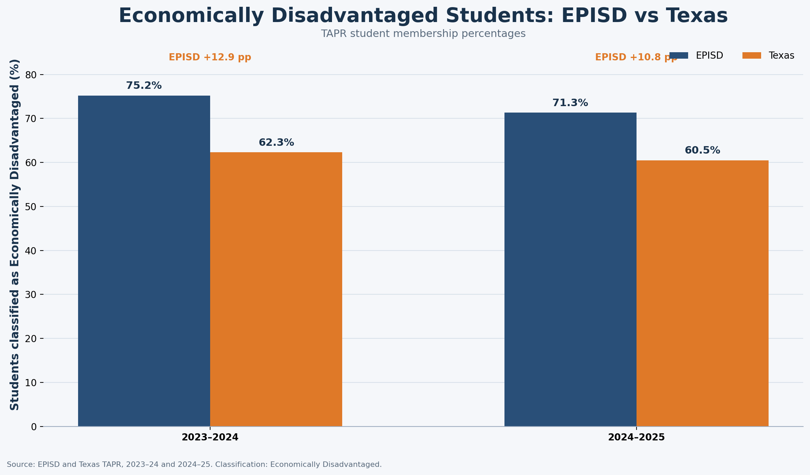

# 📊 EPISD STAAR Performance & Student Population Analysis

### AI-Assisted Data Exploration | STEM 5328

This project examines STAAR End-of-Course (EOC) performance in the **El Paso Independent School District (EPISD)** during the **2023–2024 and 2024–2025 school years**. Using Texas Academic Performance Report (TAPR) data, the analysis explores student performance alongside the demographic context of English Bilingual/Emergent Bilingual/English Learner (EB/EL), At-Risk, and Economically Disadvantaged student populations.

---

## 🎯 Research Question

**How does STAAR EOC performance differ among students in El Paso Independent School District based on English Language Learner and At-Risk classification compared with overall district and state performance?**

The final analysis focuses most directly on students reported by TAPR as **EB/EL (Current & Monitored)**. At-Risk and Economically Disadvantaged data provide additional district-level context for understanding the population EPISD serves.

> **Important:** These comparisons show patterns and possible relationships in the data. They do not establish that any student classification causes differences in STAAR performance.

---

# 🔎 Key Findings

The data reveal an important pattern: **EPISD serves substantially larger proportions of EB/EL, At-Risk, and Economically Disadvantaged students than Texas overall.**

At the same time, STAAR EOC results for EPISD EB/EL students vary considerably by subject. English I presents the largest challenge, while Algebra I and U.S. History show stronger outcomes.

Taken together, these findings suggest that STAAR performance should be interpreted alongside the demographic and educational context of the district rather than viewed as an isolated measure of student achievement.

---

# 📈 Data Visualizations

## 1. EB/EL Students Not Meeting Grade Level

### What does this show?

English I stands out as the greatest area of concern for EPISD EB/EL students. Approximately **48% did not meet grade level in 2023–2024 and 47% in 2024–2025**.

Algebra I moved in the opposite direction, with the percentage not meeting grade level increasing from approximately **23% to 26%**. U.S. History showed the strongest performance, with approximately **11% and 10%** not meeting grade level across the two years.

The differences among subjects suggest that EB/EL classification alone does not explain STAAR performance. The particularly large gap in English I may indicate that language-intensive assessments create additional challenges for students who are simultaneously developing academic English proficiency.

---

## 2. EB/EL Student Population: EPISD vs. Texas

### What does this show?

EPISD serves a **considerably larger share of EB/EL students than the Texas statewide population** in both years examined.

This difference is important when interpreting district STAAR results. EPISD is operating within a substantially different linguistic context than the state as a whole.

The comparison does **not** demonstrate that a larger EB/EL population causes lower STAAR performance. Instead, it identifies an important contextual factor that should be considered when comparing EPISD outcomes with statewide averages.

---

## 3. At-Risk Student Population: EPISD vs. Texas

### What does this show?

EPISD also reports a substantially larger percentage of students classified as **At-Risk** than Texas overall.

Because the At-Risk designation can reflect multiple academic and socioeconomic circumstances, this comparison provides another layer of context for understanding district performance.

The data suggest that EPISD serves a student population with a greater concentration of identified educational risk factors than the statewide population.

---

## 4. Economically Disadvantaged Students: EPISD vs. Texas

### What does this show?

The Economically Disadvantaged comparison reveals another substantial difference between EPISD and Texas overall.

Across both school years, **EPISD has a considerably larger proportion of students classified as Economically Disadvantaged** than the statewide population.

This does not establish a causal relationship between economic disadvantage and STAAR outcomes. However, when considered alongside the EB/EL and At-Risk data, it demonstrates that EPISD's student population differs meaningfully from the statewide population used for comparison.

---

# 🧩 Overall Interpretation

When the four visualizations are considered together, a broader picture emerges.

EPISD serves higher concentrations of **EB/EL, At-Risk, and Economically Disadvantaged students** than Texas overall. At the same time, EB/EL STAAR performance is not equally low across all tested subjects. U.S. History outcomes are comparatively strong, Algebra I falls in the middle, and English I represents the clearest area of concern.

This pattern is particularly noteworthy because English I requires students to demonstrate reading comprehension, written expression, vocabulary knowledge, and interpretation of complex texts in English. For EB/EL students, the assessment may therefore measure academic content knowledge while simultaneously placing substantial demands on English-language proficiency.

The analysis supports a **relationship between student-population context and academic performance that deserves further investigation**, but it does not support a claim that EB/EL, At-Risk, or Economically Disadvantaged status causes lower STAAR scores.

A more complete future analysis could compare these groups directly with students who are not classified as EB/EL, At-Risk, or Economically Disadvantaged and examine campus-level patterns to determine whether similar relationships appear throughout EPISD.

---

# 🗂️ Data Sources

**Texas Education Agency (TEA), Texas Academic Performance Reports (TAPR)**

- 2023–2024 TAPR
- 2024–2025 TAPR
- El Paso Independent School District
- Texas statewide comparison data

**EPISD District Number:** 071902

---

# 🤖 AI-Assisted Data Exploration

AI-assisted tools were used to support the data exploration process, including:

- identifying variables relevant to the research question;
- organizing and comparing TAPR data;
- checking values and calculations;
- generating Python code for reproducible analysis;
- creating data visualizations; and
- supporting interpretation of patterns across the selected student populations.

AI assistance was used as an analytical support tool rather than as a substitute for interpretation. Results were reviewed in relation to the original TAPR data, and conclusions were limited to relationships supported by the selected data.

---

# 💻 Reproducibility

The repository includes the materials necessary to reproduce the analysis.

### Repository Structure

    data/
        student performance and membership data

    src/
        analyze_tapr.py

    figures/
        four data visualizations

    outputs/
        generated summary tables

    requirements.txt

### Run the Analysis

Create a virtual environment and install the required packages:

    python -m venv .venv
    pip install -r requirements.txt

Run:

    python src/analyze_tapr.py

The script validates input percentages, calculates derived rates and percentage-point differences, and generates the summary outputs used in the analysis.

---

## ⚠️ Limitations

This analysis is descriptive and exploratory.

The visualizations identify patterns and differences among student populations, but **correlation should not be interpreted as causation**. Student performance can be influenced by numerous overlapping factors that are not represented in this dataset.

Additional years of data, student-group comparisons, campus-level information, and statistical testing would be needed to evaluate these relationships more fully.

---

### 📚 Project Purpose

This repository was created as part of a graduate-level data science assignment examining how educational data and AI-assisted analytical methods can be used to explore meaningful questions in education.
